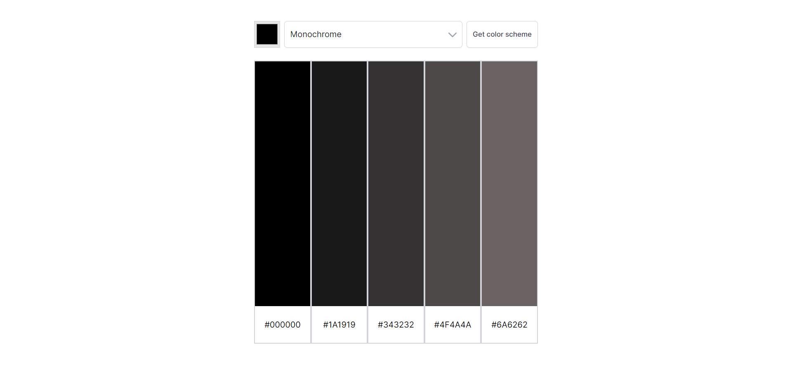
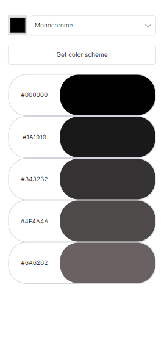

# Color Scheme Generator

Ever needed a color palette for your website but didn't know how to make one. Well look no further: the Color Scheme Generator will generate one for you. With access to the entire color wheel and 8 types of palette categories, the Color Scheme Generator will find you a scheme that is fit for your application.

- [Overview](#overview)
  - [The challenge](#the-challenge)
  - [Screenshot](#screenshot)
  - [Links](#links)
- [My process](#my-process)
  - [Built with](#built-with)
  - [What I learned](#what-i-learned)
  - [Continued development](#continued-development)
  - [Useful resources](#useful-resources)
- [Author](#author)
- [Acknowledgments](#acknowledgments)

## Overview

### The challenge
Fetch information from an API and use its data to build an application.

### Screenshot

 


### Links

Live Site: [https://color-me-silly.netlify.app/](https://color-me-silly.netlify.app/)<br>
API: [https://www.thecolorapi.com/docs](https://www.thecolorapi.com/docs)

### My process
First, worked on the HTML, CSS, and JS of the "form" portion of the app first (considered the color picker, scheme picker, and "Get color scheme" button as one collective form). Then, worked on retrieving the scheme data from the API. Next, worked on all things related to attractively rendering the palette to the UI. Finally, implemented media queries.

### Built with

This app was built with HTML, CSS, and JS.

### What I learned

``` javascript
// get the color selected after closing the color wheel pop-up
colorWheel.addEventListener("change", function(e) {
    ...
})
```
In order to get the final color chosen by the user after closing the color wheel, the `change` event needs to be used—as opposed to the `input` event, which fires every time the color is changed WHILE SELECTING the color to choose.

```javascript
window.addEventListener("load", fetchColorScheme)
```
Adding the `load` event on the `document` is FAR different from adding the `load` event on the `window`. According to Stack Overflow, the `load` event on the `window` fires once ALL the content (including images, CSS, scripts, etc.) get done loading, while when on the `document`, this event gets fired BEFORE said content is loaded.

```javascript
autocomplete="off"
```
If a form is previously filled out and not submitted, this allows the `form` to not automatically stay completed when the (Firefox) browser is refreshed.

### Continued development

- [ ] Make accessible
- [ ] Add light theme/dark/system theme

### Useful resources

Stack Overflow resource: [Form filled on browser refresh](https://stackoverflow.com/questions/7377301/firefox-keeps-form-data-on-reload)


## Author

I currently don't have any personal links other than this GitHub.

## Acknowledgements

This was a Solo project in the Scrimba Frontend Development Career Path bootcamp.